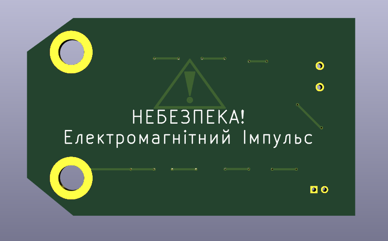
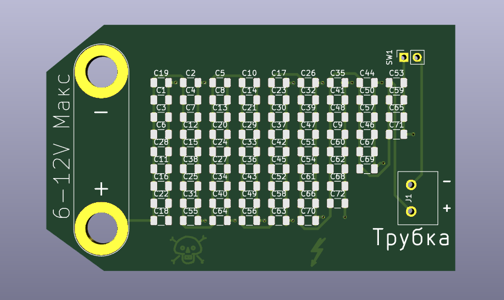
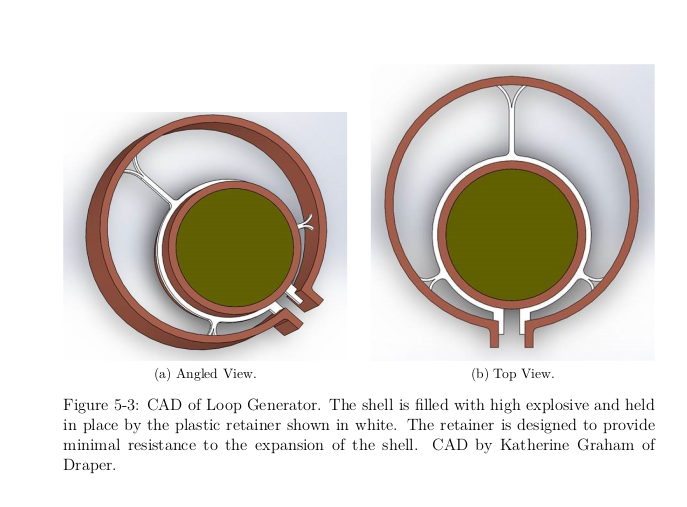
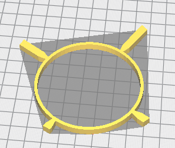

# OpenEMP

## Getting Started

### 3D Printing

3D printing files can be found in /src/3dPrint

### Schematics

Schematics were drawn in KiCAD and can be found in /src/Schematics

### Usage Information

See document [T72]()

## Purpose

The purpose of this project is to create a field-expedient small arms weapon to defeat advanced weapons systems such as tanks, APCs, radios, and other electronics-based technologies.

## Parts

The EMP consists of three parts:

1. Capacitor Bank
2. Trigger
3. Explosive Driven EMP
   * External Loop
   * Internal Loop

### Capacitor Bank

The capacitor bank supplied in this data package is single-use and designed to be affordable to mass-manufacture, relying on simple ceramic capacitors to store the seed current for the EMP. The capacitor bank consists of 72x100uF ceramic capacitors arranged in a parallel network for a total capacitance of 7,200mF which is charged externally before use via a 6-12v battery (in theory, any power source will work, including 12-24v consumer car batteries, however there is risk of damaging the board if higher voltages are used as there is NO on-board resistors to slow the charging. This is intentional to ensure the device can quickly charge up if necessary).

The capacitor bank is embedded onto a main board which houses the necessary electrical connections to utilize the device as a seed current source for the EMP. Due to the conflict in Ukraine and potential use for this device in the region, silkscreen markings have been translated into the Ukrainian language to allow insurgents fighting against Russian armor to make better use of the the device:

### Trigger

A trigger mechanism has not been included in this data-package. Instead, THT pads located at the top right of the device are utilized to allow for field-expedient "jerry-rigging" of any electronic or mechanical firing mechanism that can be derived:

One suggested triggering device is a mercury trigger or 'tilt' sensor with the detonator wired in series with the loop generator. Suitably propped up against a road or hidden under the chassis/tracks of stopped tanks for sabotage purposes would make these devices very inexpensive IEDs and anti-tank mines. The cost is only a few dollars more than a standard M67 hand-grenade with the added benefit of actually being able to disable a tank at such a low cost.

Other typical detonation sensors may be used allowing these devices to be utilized like clusterbombs dropped from aircraft onto the Russian convoys. The physical damage caused will be minimal compared to conventional (albeit more expensive) munitions, but this may be desirable for temporarily blocking bridges and roads without completely destroying that infrastructure enabling you to at a later time tow the vehicles away.

### Explosively Driven EMP

The EMP design included is based off of MIT's loop generator which is expected to produce a maximum of 36 T of flux. The EMP itself consists of a copper shell to which connects with the capacitor bank "seed source". A secondary copper pipe held in-place by a plastic retainer and filled with C-4 high-explosives completes EMP as shown in the MIT documentation:

The external loop can be fabricated by off-the-shelf 4" copper pipe while the inner loop consists of an off-the-shelf 2.5" copper pipe both pipes cut to 2" in length.

Electronics within 3 feet (1 meter) of the EMP are expected to be severely damaged or destroyed while electronics further than 10 feet (3 meters) are expected to have minimal interference. The device itself contains 0.16kg of C-4 which will cause fatal injuries to persons within 3 feet of the device at time of detonation, with eardrum rupture from the blast at distances of 10 feet or less. The EMP grenade itself is roughly equivalent to a standard issued M67 grenade in terms of explosive force with the added risk (or benefit) of the molten copper in lieu of fragmentation.

**Individuals using this EMP should take the same/similar precautions with this device as they would any typical grenade as well as ensuring that their own electronics equipment remains outside of the flux radius of the device.**

### Retainer

An alternative retainer design to the one developed by MIT is included and can be readily 3D printed with an estimated print time of 10 minutes per retainer with 20% infill.

## Construction

### Recommended Equipment

The recommended equipment for building these devices is as follows:

1. A 3D printer which can print with 0.4mm layer resolution or better.
2. Computer system with 3D printer slicer program
3. Large diameter pipe cutters 
4. Small diameter pipe cutters

If intending to make the PCB boards as well, you will also require:

5. Laser printer with toner (for PCB masks)
6. Drill press
7. Drill-bits (0.4mm, 1mm, 1.2mm, and 6.1mm)
8. Electro-plating equipment
9. 16 needles with diameter < 0.4mm
10. SMD work station

### Required Materials

1. 1 x 4" diameter copper plumbing pipe 2" long (102mm x 51mm)
2. 1 x 2.5" diameter copper plumbing pipe 2" long (65mm x 51mm)
3. 1 x 3D printed retainer (approx. 4-10g plastic filament)
4. 1 x Capacitor Bank Board
5. 0.16Kg C-4 High Explosive (or similar)
6. Detonator & Trigger Mechanism

If building the PCB board as well, you will also require:

1. 2 x 80mm x 50mm PCB boards
2. Toner transfer paper
3. 1 x PCB etching kit
4. 73 x 1206 SMD Capacitors @ 100uF
5. Solder & Flux

### Cost Estimate (Rough)

| Item                  | Qty  | Cost Per    | Subtotal |
| --------------------- | ---- | ----------- | -------- |
| 4" x 2" copper pipe   | 1    | $11.27      | $11.27   |
| 2.5" x 2" copper pipe | 1    | $4.17       | $4.17    |
| Capacitor Bank Board  | 1    | $8          | $8       |
| C-4 Explosives        | 1    | $21.17      | $21.17   |
| Plastic Filament      | 1    | $0.01       | $0.01    |
|                       |      | Total Cost: | $44.62   |

## See Also

https://dspace.mit.edu/handle/1721.1/129899
