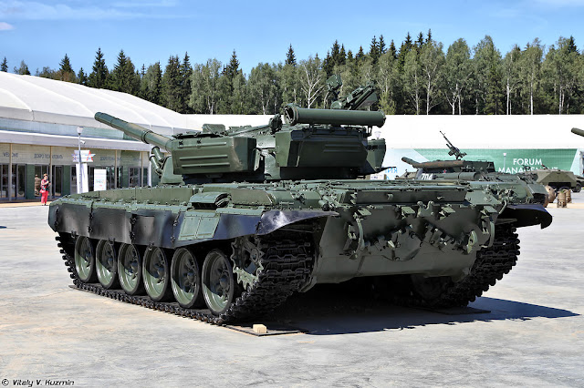

# Soviet Tank Disabling Recommendations

It is extremely difficult to determine the exact effects any given EMP device may have on electronics, however there are a few ways you can ensure interference with electronics devices, and by far the easiest way is by proximity.

## Ideal Placement

### Turret

#### Top

The turret on T-72 tanks are an obvious target for an EMP, and the top-rear of these turrets near the hatches have a shelf which are typically used to store the electronically controlled ammunition cassette elevation mechanism, a large EMP will cause permanent damage to the electronics controlling the turret and will likely induce a power surge that damages the autoloader mechanism. Damaging these electronics will force the tank crew to manually load and move the main gun of the tank reducing their combat effectiveness. Recommended target for the top turret of a thrown EMP device is as shown:

#### Sides

There is very little armor on the sides of the turret, and these typically house the majority of the tank's sensors and circuitry. A well-placed EMP on the right side of most Russian tank turrets will cause damage to the gunner's electronic aiming system forcing them to utilize manual methods. If targeting the side of the turret is desired, this is something that should be done using a 'sticky bomb' configuration of an EMP device, the actual blast damage is not important, proximity of the pulse is the primary goal.

### Sights

Many T-72 (and newer) tanks are equipped with electronic periscopes, the most common in these older tanks being the TPD-K1 with some older models relying on the 1G46 or 1K13-49 sit, and Russian BMPs relying on the VESNA-K gunner's sights shown below

These electronic sights typically have manual fall-backs, so damaging the electronics won't blind the tank, however it will eliminate their ability to use features such as the integrated laser range-finder and other electronics on board making it difficult to sight in distant targets.

The electronically controlled auto-loader systems in T-72s and newer Russian tanks are also directly coupled to these electronic sights. It is unknown the exact circuitry, but given the proximity and direct coupling, it is highly probable that an electro-magnetic pulse damaging the sights will induce current in the delicate electronics responsible for controlling the autoloader such as the ZU-172 memory unit which in T-72 tanks consist of an unshielded magnetic disc for storage and is highly susceptible to the electromagnetic interference produced by an EMP. It has been reported that these magnetic disks are a constant point of failure for the autoloader mechanism in T-72 tanks, and it is highly likely that an EMP device targeting the sights or turret will damage this component. Newer autoloader systems have further digitized the mechanism, this in theory makes these systems susceptible to EMP damage as well, although there is little information available on the control circuitry making it difficult to identify points of failure.

Placement of an EMP to disable these depends on the type of vehicle, generally anywhere that you can get an EMP device to sit next to the sensors will cause interference and damage. These sensors are typically heavily armored and designed to protect the delicate circuitry and optics from mechanical damage from small arms making electronic warfare an ideal alternative to disable them.

The newest periscopes utilized on Russian armor integrate even more sensors which are inherently vulnerable to electronic warfare attacks, below is the highest resolution cached photo available from a Russian site detailing these systems (site is no longer accessible due to sanctions):

### Missile Guidance Systems

Depending on the munitions being carried by the armored vehicle, it may make sense to target the munitions. Later iterations of the T-72 tanks are capable of launching a variety of missiles relying on electronic guidance systems such as the 9M119 "Refleks" guided missile. These systems are typically line-of-sight laser systems requiring a gunner to continually 'laze' the target. Embedded inside the missile is control circuitry which analyzes light patterns to identify where the target is and control the stabilizing fins to guide the missile to the target. By damaging the tank's laser systems with an EMP, you can eliminate the guidance abilities of these missiles. Radio-controlled missiles can also be turned into "dumb" missiles using EMP attacks on either the tank or the warhead.

### Engine

Attacks targeting the engine if successful will render the vehicle immobile and are not field-serviceable. From the older T-64A battle-tanks to modern tanks today, fuel injected engines require electronic control modules. While older engine computers are less frail than newer ECUs and ECMs, damage to the internal firmware from an EMP regardless of the type of memory used is highly probable, especially as it is very likely that the engine will be running when the EMP detonates. The EMP itself will dump several thousand kilovolts into an engine computer causing shorts in the circuitry.

An example of a short in a modern (consumer) engine control unit is shown below, a static pulse caused a 12v power line to be temporarily shorted to ground which resulted in the on-board voltage regulator dumping the full amperage of the battery into the PCB physically burning the copper traces, melting the PCB itself, damaging multiple components on the board which got so hot that many of the solder joints physically melted. Replacing the board and possible damaged sensors is required to repair a vehicle damaged in this way, it's not typically something that can be serviced in the field, but it does allow for enemy tanks captured in this way to be repaired after combat for use in further missions.

On nearly all armored vehicles, the engine is located inside a compartment at the rear of the vehicle. Typically these are well armored to protect from small arms fire, but have ventilation ports which are necessary for intake and exhaust. In T-72 tanks, the engine is located underneath the rear storage compartment with ventilation ports at the top, the large surface area, open ventilation ports, and ease of access make this a perfect target for molotovs and other destructive devices. Likewise, placement of an EMP device on this portion of the vehicle is an effective strategy for disabling vehicles you desire to capture and repair/re-use for your own forces.

